# **#4 HOWTO**

#  **How to integrate Siemens S7 PLC and Inveo LANtick module using Modbus TCP/IP**

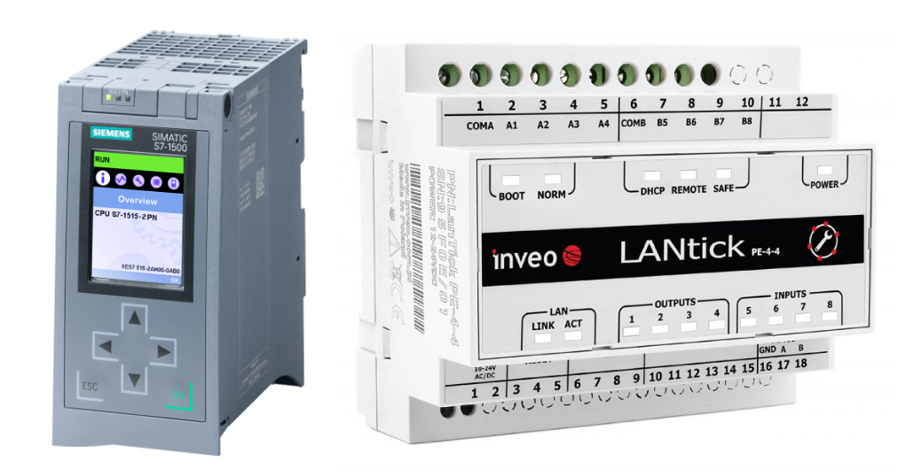

[**https://inveo.com.pl/main/**](https://inveo.com.pl/main/) **Author: Wiktor Bień**

S7 PLC configuration

This tutorial is intended to demonstrate the process of configuring the Inveo LANtick module with Siemens S7-300/S7-1200/S7-1500 controllers using the Modbus TCP/IP protocol. 

We start by creating a new project and selecting a controller - this can be any controller from the S71200/S71500 family and selected S7300/S7400 models. In our case, it will be a 1511-1 unit.

Ensure that the reader and the controller are on the same network.

In our case it will be:

*   S7-1500 - IP: 192.168.0.1
    
*   Inveo LANtick module - IP: 192.168.0.2
    

We start by creating a function block to handle the Modbus TCP/IP communication protocol, in my case it will be called **“Modbus”**. After creating it, we can call it in **“OB1”**. 

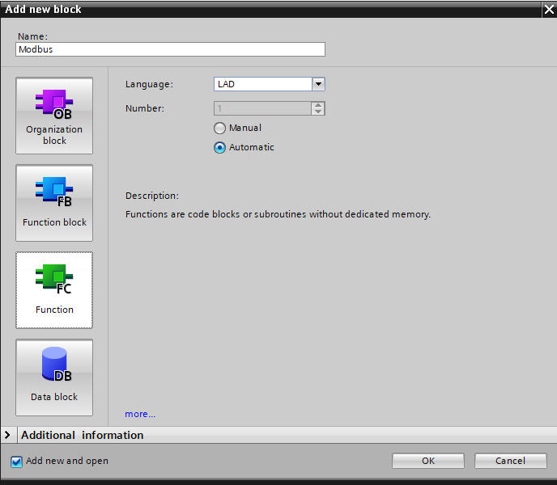

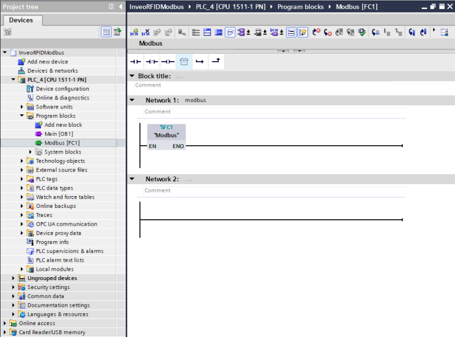

The next step is to call the MB\_CLIENT function block inside the **“Modbus”** block, which you will find under **“Communication” -> “Others”**. Ultimately, we will have to use two such blocks - one for reading and the other for writing **“Single Coils”** registers. For now, let's focus on the block for writing data, that is, for controlling outputs.

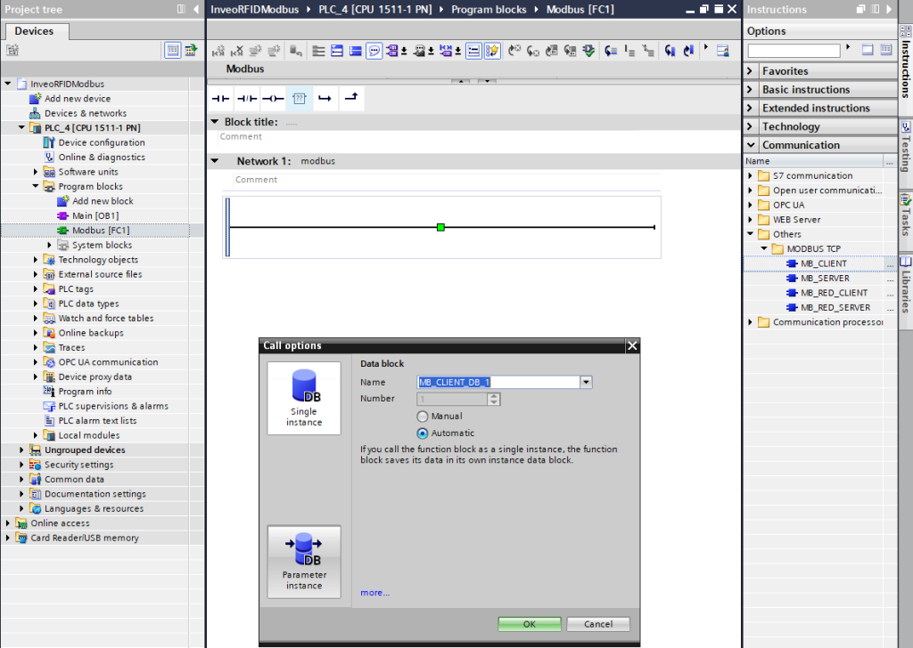

When the block is called, you will see the inputs marked in red for the data necessary for configuration and connection establishment - without filling them, the program will not compile. Therefore, we need to create a data block with configuration data.

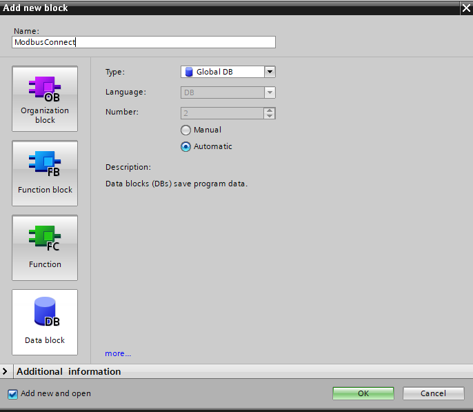

In the block, we create the following variables:

**“MbTCPClientRead”** and **“MbTCPClientWrite”** are structures for configuring network settings. The variable **“MbDisconnect”** will be used to disconnect the Modbus.

The structures should be filled in as below, the parameter **“InterfaceId”** will depend on the hardware network ID - you can check its value by going into the driver settings **“properties”** **\-> “System constants”** in our case it is 64. The **“ADDR”** array is the IP address of our reader, **“RemotePort”** is the communication port, 502 is the standard port for Modbus TCP/IP.

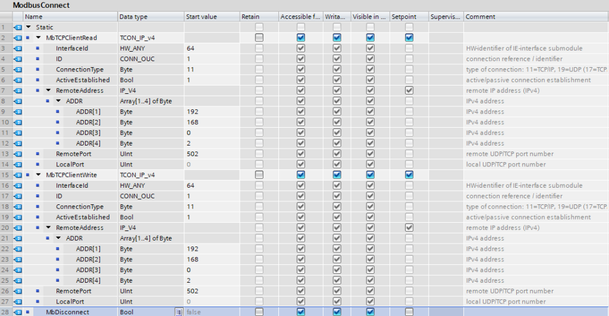

Let's create another block, where we will already store data for reading and writing **“Single Coils”** registers via Modbus.

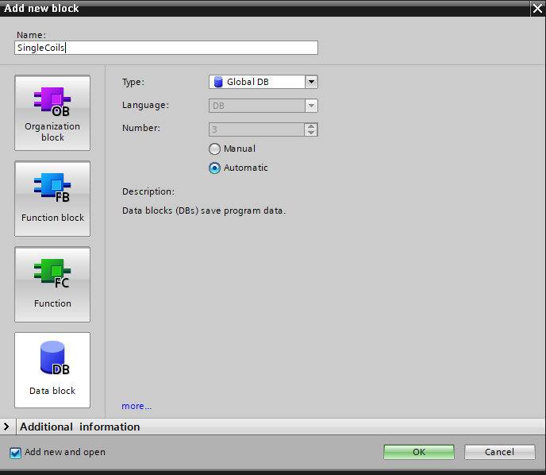

It is important that the block on which the register reading and writing operations will be performed is properly configured. We need to disable the optimization of the block will result in the addition of an “offset” column in the data block.

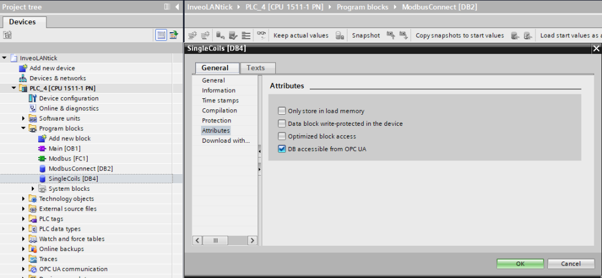

After configuring the block settings, you need to create two arrays, one for outputs and one for inputs. In my case they will be called **“Outputs”** and **“Inputs”** they will each store 4 bool elements because I am using LANtick 4-4, for other LANtick models the arrays will each store 2, 8 or 16 elements depending on the number of inputs/outputs. After creating the “Outputs” array, we can connect it to the **“MB\_DATA\_PTR”** input of the **“MB\_CLIENT”** block. This is the pointer we need to pass in order to store this data.

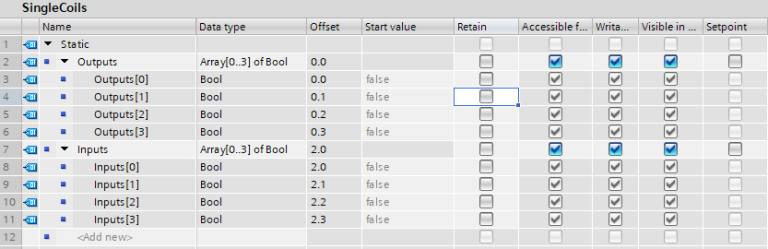

The next step is to assign the variables we created earlier from the **“ModbusConnect”** and **“ModbusData”** blocks to the **“MB\_CLIENT”** block. Keep in mind such parameters as **“MB\_DATA\_LEN”** , **“MB\_DATA\_ADDR”** and **“MB\_MODE”**.

The value of the **“MB\_DATA\_LEN”** parameter depends on the number of outputs of the module. **“MB\_MODE”** is set to the value of 1 - this means the data writing mode.

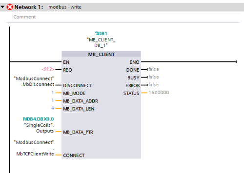

The last item needed to complete the configuration of the block for data recording is to connect the clock to the **“REQ”** input. Setting a high state to the **“REQ”** input 

will cause data to be sent. The data will be updated every 100ms - you can adjust the frequency of the clock according to your needs.

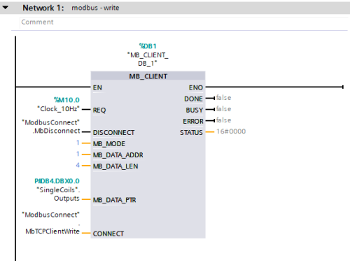

The **“MB\_DATA\_ADDR”** parameter for the block for outputs will be 1 due to the fact that the registers for handling outputs come first: 

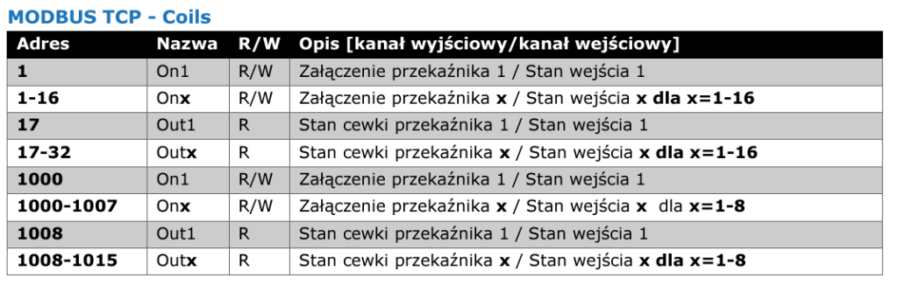

If you haven't configured hardware clocks in your project then you need to do so to get the desired effect.

As a reminder, to configure hardware clocks you need to go into **“Properities” -> “System and clock memory”** then you need to activate the checkbox **“Clock memory bits”** and set the initial Tag mapping the area of clocks in memory.

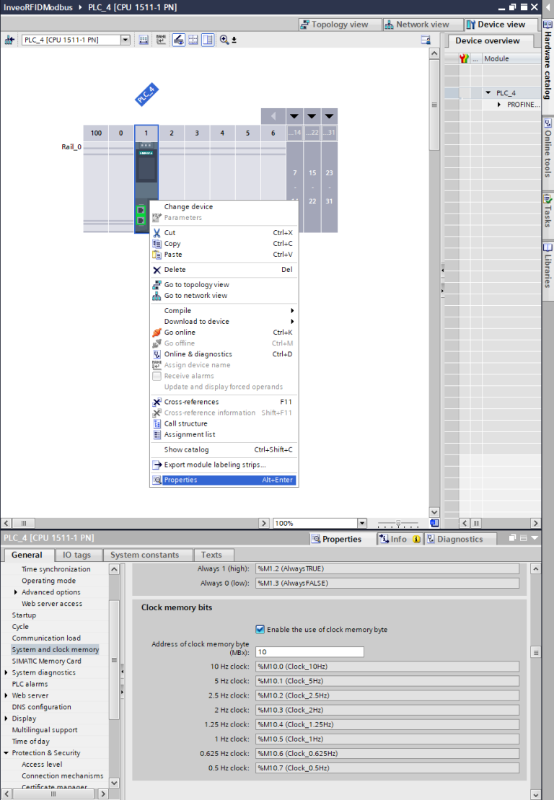

The block for controlling the outputs has been correctly configured, now with a few simple steps we will create a second block for reading the state of the inputs. Copy **“MB\_CLIENT”** and assign variables for reading data in the appropriate fields.

Copy the block to another network and replace the data in the **“MB\_DATA\_PTR”** and **“CONNECT”** fields with read data, respectively. Since the block will be used for reading data, you need to change the mode, i.e. the **“MB\_MODE”** parameter to 0, which means read. The last operation required for the Modbus to read data correctly is to set the clock state in the **“REQ”** field. The parameter **“MB\_DATA\_ADDR”** in this case takes the value of 5 because our LANtick has 4 outputs, and the first input is on the register following the last output, that is, on register number 5.

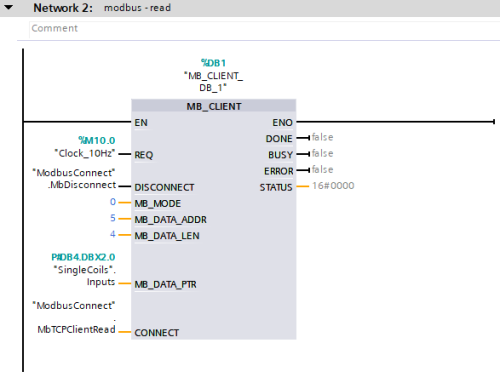

LANtick module configuration

It is time to configure the Inveo LANtick module. The operation of this module is done entirely through the built-in web server. When you connect to the reader for the first time, you should enter its default IP in the browser: 192.168.111.15. During this operation, make sure that our network card is in the same class as the reader.

After connecting to the reader we will be asked for a login and password, the default login credentials are:

**login - admin**

**password- admin00**

It is recommended that you change the login and password so that unauthorized people do not have access to change the configuration of the device.

When using our **Discoverer** application, our network card may be on a different subnet.

After logging into the device, let's go to the **“Network”** tab. Let's change the default IP address of the reader to what our application requires. At first, we assumed that it will be 192.168.0.2. After saving the data with the **“Save”** button, the network settings will be saved and the reader will restart.

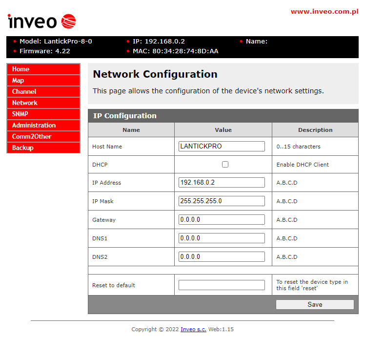

After configuring the reader's network, you still only need to activate Modbus TCP/IP in the **“Administration”** tab:

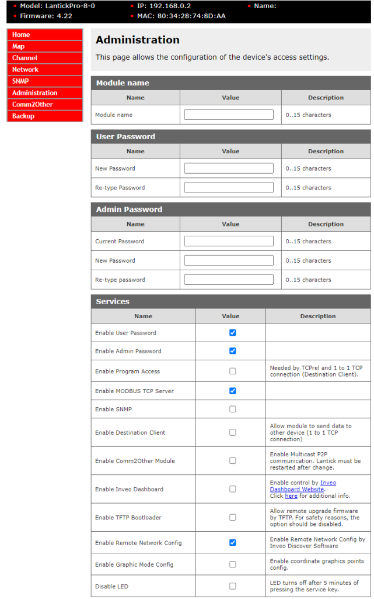

Communication test

After performing these two above steps on the reader's web server, we should be able to correctly transfer data between devices. After uploading the software to the controller and displaying the preview, we should see the statuses of the blocks switch every 100ms to the values 7004 and 7006 which means correct data transmission.

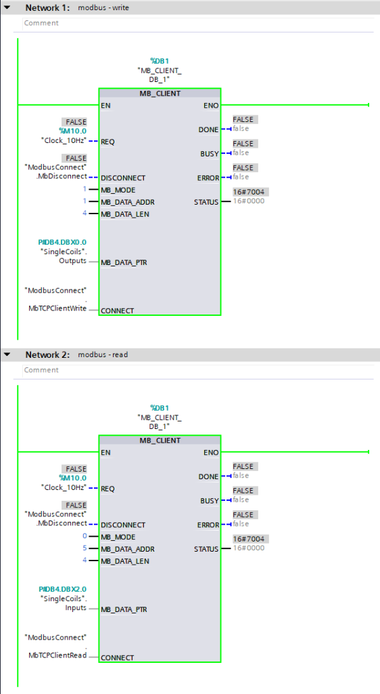

Error table

If you have problems establishing communication between devices, check the statuses you receive when trying to receive/send data and analyze them against the error table available below:

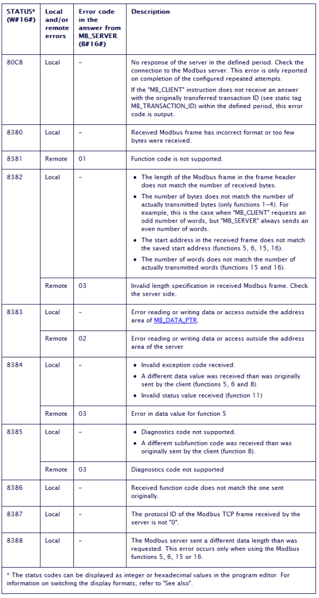

IO test

The operation of inputs and outputs can be tested using the main panel on the LANtick module's web server.

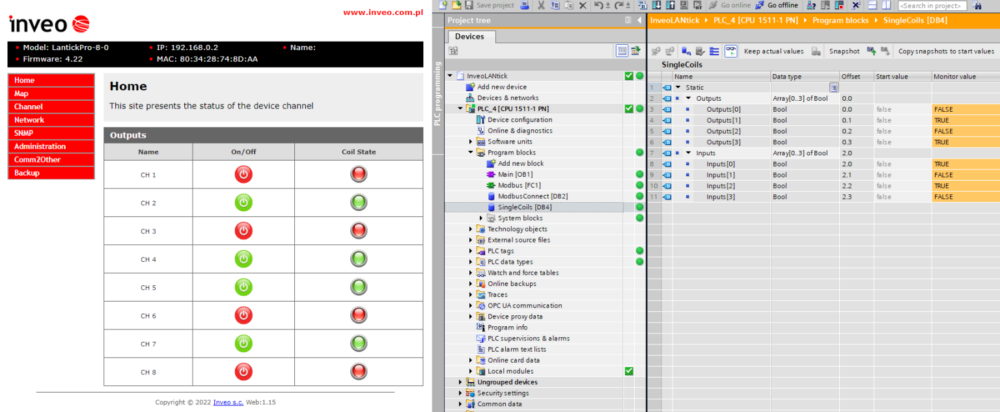

Ending

If you have reached this step it means that you have correctly configured the Inveo LANtick module, congratulations!